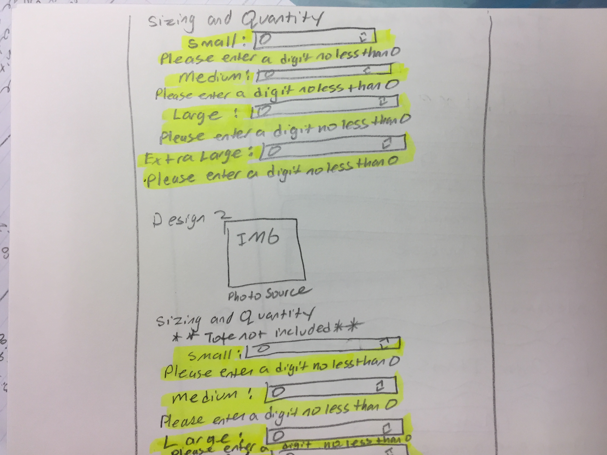
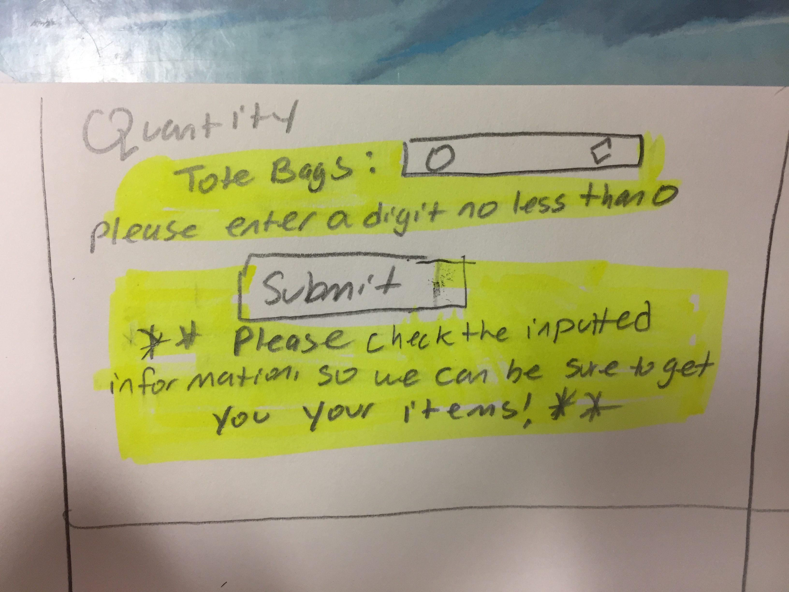

# Project 3 - Design Journey

**For each milestone, complete only the sections that are labeled with that milestone.**

Be clear and concise in your writing. Bullets points are acceptable.

## Milestone 1

## Target Audience (Milestone 1)

[Who is your site's target audience? This should be the original target audience from Project 1 or Project 2.]

My target audience are undergraduate students living on campus. They have disposable income and are looking forward to spending money at the festival. Since they have disposable income they will be looking for souvenirs that they can take home from the festival so that they can remember the festival.

## Planning & Designing User Input (Milestone 1)

[Determine what purpose the form for your site will accomplish, where it will go (physical placement on page and the HTML file name), and what form elements you plan on using.]

The purpose of my form is for the users to be able to pre-order t-shirts and/or tote bags that they can pick up and pay for at the festival. This can allow users to ensure that they will have a shirt waiting for them at the festival and not have to worry about the vendor running out. It will go on the merchandise page underneath the information about the t-shirt company.

The specific HTML file name the form will go on is merchandise.html.

The form elements I plan on using are.
- type="text"
- type="email"
- type="tel"
- type="radio"
- type="number"
- type="submit"

[Include sketches on your form below. Include sketches of your mobile and desktop versions. Image must show in Atom's Markdown Preview, otherwise 0 points for sketch. (Remember your relative URL should be case sensitive.)]

Before feedback
These are the original sketches
desktop sketch

original mobile sketch

These are the revised sketches I have made.
This is the revision sketch for the desktop

These are the revision mobile sketches

[What submission method will your form use? GET or POST. Explain your reasoning.]
I will be using POST. I don't want the name, email, phone number, and what the user bought in the url. Since not only would it make the url very long, but a lot of that is personal information. You wouldn't want your email or phone number in a url for other people to see. The reason is that if you were to let's say post the link on social media then everyone would have information on your name, email, phone number, and what you bought. Also, with POST when you refresh a page you won't be submitting the form multiple times and getting multiple items that you didn't want.

## Determine the Form Validation Criteria (Milestone 1)

[For each control in your form, specify the validation criteria and your reasoning behind the criteria.]
The first form control in my form will be (type="text"). The validation criteria will be (maxlength="100"). This is because I want to prevent people from inputting in something that isn't a name, for example this will prevent a person from copy and pasting an essay. This constraint also works because I am using (type="text") so that users can input their names and names are typically not even 100 characters. This will be required because it will make it easier to have the person pickup their shirt at the festival since they can just tell me their name. Also, if any correspondence needs to take place I know how to address the person.

For the form control (type="email") I will have the validation criteria be that an actual email was inputted. The reason is that I don't want someone to mix up putting their name into the email field. Also, the type="email" ensures that only a valid email is accepted so there are no other added constraints. It wouldn't be helpful to just have a name because then I wouldn't be able to contact the person to let them know that their shirt is ready and that their order was received. The email will be required because I need some way of contacting the person.

I will be using the control (type="tel") so that I can contact a user about their shirt for example if there are any updates about it like if we ran out. With the control (type="tel") there are no default constraints because of all the different kinds of phone numbers that exist that range from local to international numbers. Though I have myself put in a constraint to make sure the length of phone number is only 10 characters by inputting size="10". I put in this constraint because most typical phone numbers are only 10 digits and international students most likely have an American phone number. The phone number will not be required because with the email I have a means of contacting the person. But, if the person chooses they can also include a phone number if they want to ensure there are multiple ways to be contacted. Also, the purpose of this constraint was also to stop someone from accidentally typing their name in that field or their email.

(Type="radio") will be used so that users can indicate what day at the festival they are picking up their items. With a radio button only one button in a group can be chosen. I chose the radio button because I want users to be specific on the date they are going to pickup their item, so that the vendor doesn't have to bring shirts that are not going to be picked up that day to the festival. A feature I have added is that one of the options is a default option, meaning it is already checked. This is not required to fill out manually because the default date will be to pickup the shirt on the first day of the festival. The form will just assume that the person will pick it up the first day, unless the person specifies one of the other dates. A radio button doesn't have any constraints since it doesn't have a value to be constrained.

I used (type="number") so that users can indicate the amount of shirts/tote bags they want. The constraint with this form control is that users must enter in a number. This constraint makes sense because it wouldn't make sense for a user to type in a letter for the number of shirts they want. Another constraint is that the user cannot put in a negative number for the quantity of shirts because that wouldn't make sense. At the lowest value users can only have it be 0 meaning they don't want the shirt or any number greater than 0 to indicate the number of shirts they want. I implemented this constraint by using (min="0"). The quantity of shirts can only increase by 1, which I did through (step="1"). This is because a user can't ask for 1.5 shirts because you can't just get one shirt and half a shirt. The controls are not required because I can't force the person to buy every single shirt. The user will be able to just enter in information for items he wants.

The submit button (type="submit") is there so users can give their forms to the server so that the vendor knows how many shirts to make. This is a required for the user to click so that his order goes through. If he doesn't click it then he won't get anything. The submit button does not have any constraints because it doesn't have a value to be constrained.

## Design Form Feedback (Milestone 1)
[Include sketches of your mobile and desktop feedback.]

Original desktop sketch with Feedback

Original mobile sketch with Feedback

Continuation of the original mobile sketch with feedback

revision desktop sketch with feedback

revision mobile sketches with feedback

##  Plan Validation Pseudocode (Milestone 1)

[Write your form validation pseudocode here.]
When the user tries to submit the form:

If the name is empty:
  Show a feedback message: "Please enter a name."
Otherwise:
  Show no feedback message.
  Submit Form

If the email is empty or not valid:
  Show a feedback message: "An email address must have a single @."
Otherwise:
  Show no feedback message.
  Submit Form

If the phone number is empty:
  Show no feedback message since it will not be required.
If a phone number is inputted but it is less than 10 digits:
  Show a feedback message:"Enter in a 10 digit phone number."
Otherwise:
  Show no feedback message.
  Submit form

If a pickup date is the default date or is one of the other dates:
  Show no feedback message.
  Submit form

If indicated quantity is less than 0 or is not an integer:
  Show a feedback message "Please enter a digit no less than 0."
Otherwise:
  Show no feedback message.
  Submit form

If errors occur above after the user clicks submit:
  Show a feedback message "Please check the inputted information, so we can be sure to get you your items!"
Otherwise:
  Show no feedback message:
  Submit form

## Additional Information (Milestone 1)

[(optional) Include any additional information, justifications, or comments we should be aware of.]

## Final Submission

### Task Planning (Final Submission)

[Plan out your one task for the Final Submission here before doing your user testing.]

Complete an order form using the name Jane Doe, email jd@cornell.edu, and choose at least one item to order.

### Participant 1 (Final Submission)

1. Who is your participant, e.g., what is their name, where do they comes from, what is their job, characteristics, etc.?
My participant is Ashni. She is a sophomore living on West Campus and she is a student from CA. She also has a job at the Tatkon center. She is very sentimental and likes to buy little trinkets to remember events. She cares about her family a lot and she is the oldest sibling, so she is very responsible.

2. Does your participant belong to your target audience of the site? (Yes / No)

[If “No”, what’s your strategy of associating the user test results to your target audience’s needs and wants? How can your re-design choices based on the user tests make a better fit for the target audience?]

Yes, she belongs to my target audience.

### User Testing for Participant 1 (Final Submission)
[Report the results for your user's performance on each of your tasks. You should **describe the task** you ask the user to complete, explain **what the user did**, describe the user's **reaction/feedback** to the design, **reflect on the user's performance**, determine what **re-design choices** you will make. You can also add any additional comments in the **memo** field.]

### Here are screenshots of what my form looked like for both of the user testing without the feedback ###

Format:
- Task #1
  - **Task Description** (What was the task for this user?)
    - Complete an order form using the name Jane Doe, email jd@cornell.edu, and choose at least one item to order.
  - **How did the user do? Did that meet your expectation?**
    - The user was able to meet my expectations for the entering the name, email, and ordering at least one item.
    - This part met my expectations since it helped tell me that the flow was logical.
    - I did not specify to her a phone number because in my form that is an optional control.
    - However, She ended up filling out the phone number without me telling her to and there were problems with this. She had assumed that she would be able to put in dashes. But, with the way I had set it up I had made it that she could only put in 10 characters because I had thought about how most people only have 10 digit phone numbers.
    - My expectations were not met because I hadn't realized that a user isn't going to automatically know to only put in digits without dashes or parenthesis for a phone number.
    - Something weird happened in which somehow she clicked something and it took her back to the index.html. I have looked into this issue and I could not figure out how she did it. I think she may have just made a mistake with using the mouse because she is not very familiar with how to use the scrolling on a Mac, since she owns a PC. My expectations weren't met regarding this because I did not expect this to occur.
  - **User’s reaction / feedback to the design** (e.g., specific problems or issues found in the tasks)
    - User was very frustrated about the phone number control. This is because I had not put in clear signs initially as to how I had only wanted digits. Even when she got the feedback message next to the phone number I noticed that she still put in dashes.
    - User said she liked the design and that it looked clean. A design concern was the submit button. She said I should make it more "central" or bigger.

  - **Your reflections about the user’s performance to the task**
    - With the user filling out the telephone number when I hadn't specified for her to told me that the telephone number being optional was not clear.
    - The user had some trouble with using the mouse on the Mac since she wasn't really familiar with the scrolling technique on it. She didn't look very comfortable with using the mouse, which I think made her feel a little flustered. This makes me think that perhaps for future user testings that I invest in a basic external mouse that I can connect to my computer since more people will understand how to use that since I know that not everyone is familiar with the Mac mouse pad. I think this would be a good solution so that the user doesn't feel like she is "testing" two things, the form and the mouse.
    - The user should not of had to feel frustrated due to the poor design I had created for the phone number. This was not an error on the user's part, rather it was an error on my end of not putting in the necessary information to help the user know what exactly the form wants.
    - The user understood how to input the quantity of items she wanted which conveys to me that the formatting and controls I used were logical.
  - **Re-design choices**
    - For the phone number, I don't want to get rid of the constraint of the 10 character limit. I had thought about just getting rid of it and letting the user type in a phone number the way he/she wants, however this would create inconsistencies in the form responses. It would be difficult for the person who does look at the responses to have phone numbers written in several different ways. Also, the standard American phone numbers is 10 digits.
    - My solution to this is that for starters I will have next to the input for the phone number that it is an optional field. Also, I will put in a placeholder that shows an example of how I want the phone number written.
    - I am also going to make the submit button larger so users can see it better.
  - **Memo** (Justify your decisions; additional notes.)
    - [You should fill this out]

[Include evidence that you conducted user testing.]

Here are the notes that I took during user testing. They're just quick bullet points and arrows of what I saw and the feedback I got from the user.

The user testing notes from user 1.

### Participant 2 (Final Submission)

1. Who is your participant, e.g., what is their name, where do they comes from, what is their job, characteristics, etc.?
My participant is David and he is an engineering student at Cornell from PA. He is living on North Campus as an RA. He's busy since he is in a lot of credits and clubs on campus. He is the youngest child and his sister graduated from Cornell. He is carefree and likes to make a lot of jokes.

2. Does your participant belong to your target audience of the site? (Yes / No)

[If “No”, what’s your strategy of associating the user test results to your target audience’s needs and wants? How can your re-design choices based on the user tests make a better fit for the target audience?]

Yes, he is in my target audience.

### User Testing for Participant 2 (Final Submission)
[Report the results for your user's performance on each of your tasks. You should **describe the task** you ask the user to complete, explain **what the user did**, describe the user's **reaction/feedback** to the design, **reflect on the user's performance**, determine what **re-design choices** you will make. You can also add any additional comments in the **memo** field.]

Format:
- Task #1
  - **Task Description** (What was the task for this user?)
    - Complete an order form using the name Jane Doe, email jd@cornell.edu, and choose at least one item to order.
  - **How did the user do? Did that meet your expectation?**
    - The user for the information he was told to input did well, except for ordering an item. The reason is that for the design 3 size medium shirt he had accidentally put in a letter and the form went through when it should not have. This did not meet my expectations because I did not think the form would have gone through with that error.
    - User had trouble with entering the phone number. He put in dashes for the phone number and realized that he wasn't suppose to add them in when he couldn't type anymore because of the character limit. Thus, he did end up just putting in digits.
    - My expectations were not met because I realized the design was not logical and understandable for the user.
    - User both manually entered the numbers and used the up and down buttons for the inputs for the items.
    - My expectations were sort of met when it came to inputs. The reason is that I realized after that he had put in a letter in design 3 instead of a number, but he didn't know that because he got no feedback error since the form got submitted. Inputting a letter occurred by accident since it was just a single letter and it wasn't like he wrote out the spelling for a number.
  - **User’s reaction / feedback to the design** (e.g., specific problems or issues found in the tasks)
    - User did not like how the phone number section was not clear. He wished it would have been more specific that it wanted only digits. He didn't even know that the phone number was optional.
    - User felt that the submit button was hidden and did not like that it was on the right hand side.
    - He said visually the form does look appealing.
  - **Your reflections about the user’s performance to the task**
    - The user should not of had to realize mid typing the phone number that he could only put in digits. Thus, I need to make sure that from the start I am setting up the user for success by being clear about what the constraints are. It makes sense that both of my users were confused as to how to type in the phone number because on order forms their is no standard way to put in a phone number. Some ask for just digits, others want parenthesis and dashes, which makes it confusing for the user. Thus, I need to be clearer with what I want exactly from the user from the start, so the user doesn't get confused.
    - The user was able to submit the form, but he shouldn't have had to feel like the button for him to click submit was hidden.
  - **Re-design choices**
    - First off, I realized that after the testing was done and I looked at the form values that he had entered in a letter into design 3 size medium. This made me realize that in my JavaScript I had an error for all of design 3. I had forgotten to change for each formValid of design 3 sizes to false when it went through the else statement.
    - I am planning as I had said earlier to create a placeholder that shows an example of what the user should do for the phone number. I am also going to have next to the input say that it is optional to fill the phone number out. Then if a user inputs a value and let's say it is not enough digits the user will get a feedback message telling him to enter only 10 digits. This could occur if he accidentally types in his name into that field
    - I am going to move the submit button to the left and make it bigger.
  - **Memo** (Justify your decisions; additional notes.)
    - In class we had talked about how with forms the users will look down it vertically to input information into the fields and that then the user would look to the right to submit the form. However, I have decided to go against the principle we have called in class. Prior to user testing I had thought that the submit button being on the right hand side looked weird and that it disrupted the flow of the form. But, I had decided to just keep it on the right hand side because in lecture we were told to have it on the right hand side. However, I learned through my both of my user testings that it is not fully intuitive for the form I made that the submit button be on the right hand side. The user shouldn't have to feel like he/she is searching for the button.
    - I believe that for the desktop version it will be best to have the submit button the left hand side, especially because the user's eyes stay on the left hand side of the screen because all of the information he has to input is on the left. Also, people read from left to right. Thus, it makes sense to keep all the important information on the left hand side. Like I saw from my user testing when users didn't see the submit button on the left hand side after all of the other content they took a little longer submitting the form because they had to look for the submit button since they have to scan the page for the button. Furthermore, this design will help with how people view forms from the top to the bottom because they will see that the submit button is right under all of the other content.
    - For the mobile version I will put the button in the center.

[Include evidence that you conducted user testing.]

Here are the notes that I took during user testing. They're just quick bullet points and arrows of what I saw and the feedback I got from the user.

The user testing notes from user 2.

### Additional Users...

[If you conduct more user tests of your website, include your tests here. You are not *required* to conduct these additional tests, but you might find them helpful for refining your website.]

### Additional Design Justifications (Final Submission)

[If you feel like you haven’t fully explained your design choices in the final submission, or you want to explain some functions in your site (e.g., if you feel like you make a special design choice which might not meet the final requirement), you can use the additional design justifications to justify your design choices. Remember, this is place for you to justify your design choices which you haven’t covered in the design journey. Use it wisely. However, you don’t need to fill out this section if you think all design choices have been well explained in the final submission design journey.]

I changed the feedback message that occurs under the submit button for when the user makes an error somewhere on the page. Originally, it was "Please check for invalid fields." However, I realized that is a bad kind of feedback message since it creates a negative experience for the user. I changed the message to "Please check the inputted information, so we can be sure to get you your items!" I think this works better because it sounds more friendly and more human like, instead of a cold computer. It makes the experience more pleasant because the user won't feel like he made a huge mistake because this message sounds more like a friendly notification.

For my feedback messages I originally had the background of them red. I thought that made sense because red means an error. However, I feel that red is not be the greatest choice. For starters red is associated with DANGER! However, for a form for purchasing clothing there is no severe danger involved. Using a light yellow comes across more gently to the user and conveys to the user that these are small correctable mistakes. Red can make the user feel like he made a huge mistake and make him feel overwhelmed.

What it originally looked like.

What it now looks like.

The change in background color of the feedback message creates different feelings. The red one makes it seem more severe and daunting while the yellow one is much gentler.
